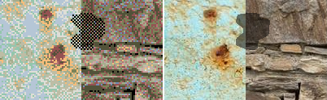
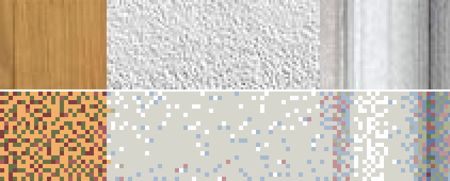
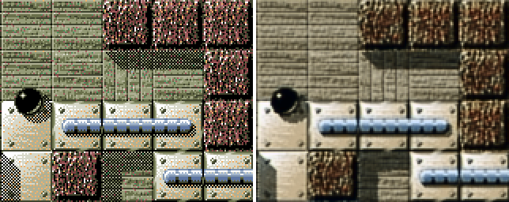

#De-Ditherer

A feedforward network for interpolating 4-bit images with a custom palette to 24-bit color


##Instructions

For base functionality:

* Have a CUDA-compatible system.
* Put screenshots from the game Per.Oxyd into the folder "test images".
* Run with Python 3.6:

```
pip3 install -r requirements.txt
python test_image.py.
```

Output will be generated into the folder "test results".

####Alternatively: training the model to de-dither images with your own palette

* Install Imagemagick. Make sure the command "magick" can be called from everywhere.
* Create two subfolders "train" and "val" in the folder "raw training images". Fill the two subfolders with at least 200 flat, crisp photos of real-world textures. Size constraints: 240x240 minimum, 240 megapixels maximum.
* Replace the palette "PerOxyd.bmp" by the one your source material requires. Up to 256 colors are supported. The filename is hard-coded in prep\_training\_data.py, line 133.
* Run with Python 3.6:

```
pip3 install -r requirements.txt
python prep_training_data.py
python train.py
python test_image.py
```


##Background

Per.Oxyd (1995) is one of my favorite puzzle games. At the time, games were limited to the VGA standard, which gave developers two choices:

- a resolution of 640x400 and 16 colors
- a resolution of 320x200 and 256 colors

Most games in 1995 went for the lower resolution and higher color depth because the limit to 16 colors was artistically too challenging. Per.Oxyd bucked this trend and went for the high resolution. To cope with the tiny color space, the developer went for two tricks that were unusual at the time:

- a carefully optimized, custom 16-color palette
- heavy dithering on all textures


Both the resolution and the color palette are looking very dated today when playing on a large monitor. The contemporary remake of the game, Enigma, has a lower-quality tileset. Since I still enjoy playing this game, I decided to polish the original textures and make them compatible with the 21st century.

## The magnitude of the problem

The game's textures have obviously been optimized side-by-side with the palette, and the developer seems to have used an automated dithering approach. This becomes obvious when looking closely at the titular Oxyd stones. These tiles appear in every level and the color/shape coding is critical for progressing to the next puzzle.


These block demonstrate that my approach has to resolve at least two non-trivial problems:

- Problem #1: The base color of these blocks is clearly intended to be grey, yet they are speckled with random red, green and blue pixels. These off-color pixels are present in almost every texture of the game. The interpolation will have to recognize these outliers and replace them with a smoothly-colored base texture.
- Problem #2: One of the most critical game elements, the green cross, originally consists of mostly grey pixels - especially in its center area. The interpolation will have to infer that a solid green fill color was intended, instead of yielding a grey cross with green edges.

I briefly thought about reverse-engineering and inverting the original dithering function, but I figured a neural network would be  much easier. It would give me the option to scale up the resolution too, if the results were promising.

## Building a training set

This is the 16-color palette that the game uses to display absolutely everything: start screen, menus, tiles, cursors, shadows, and the marble that the player controls.


I extracted it from the game, and scraped together ~2500 images to train my AI. Since the game seems to go for a somewhat photorealistic approach, my reference images consisted of photographs of flat, real-world textures. Sizes varied from 240x160px to 25000x18000px, and the median dimensions were 1600x900px. I made sure that they were free from noise and compression artifacts, and scaled images down if they weren't sharp enough at the pixel scale. The total filesize was 4.6 GB (all in PNG format). I separated 10% of those images into a representative validation group and moved onto the next step. Here's a random selection from the reference set at a 2x magnification:


Next, I used Imagemagick to reduce the color depth from 24bit to dithered 8-bit. I first went with the Riemersma dithering algorithm, but after looking very closely at some patterns I decided that the game probably used Floyd-Steinberg instead and switched to that.

```
magick convert input.png -remap palette.png -dither FloydSteinberg output.png
```
This conversion took about 40 minutes on an AMD Ryzen 2600x. Here's how the same eight texture samples looked afterwards, at a 2x magnification:


Notably, the pure grey sample #4 and #8 show a lot of colored pixels, just like the textures in the game that seem to be intended to be grey. This showed me that this reference/target pair was suitable for representing fundamental problem #1, and I started building a neural network.

## Building the AI

After a lot of literature research, I decided to base my code on the project [ESPCN](https://github.com/leftthomas/ESPCN). After seeing them work successfully in the project [SubCNN](https://github.com/tanshen/SubCNN), I changed ESPCN's *tanh* activations into the much faster *relu* activations. Finally, the paper [Generating High Fidelity Images with Subscale Pixel Networks and Multidimensional Upscaling](https://arxiv.org/abs/1812.01608) made me suspect that ESPCN's network architecture should already be able to perform colorspace interpolation without modifications. This suspicion turned out to be correct.

I modified the original ESPCN code in three key aspects:

* My network accepts RGB images, instead of the original greyscale (this was crucial for solving fundamental problem #2)
* My data loader extracts random segments from the training set on the fly, providing more variety and allowing me to use a wide variety of image resolutions
* My training procedure uses a fixed number of 500 training units per epoch, instead of going through the entire batch each time

## Training

In total I tried 18 different setup configurations. The network usually converged after 220 epochs, which took 1-2 hours on a Nvidia GTX 980 Ti. I didn't touch the original learning rate.
The ESPCN layout turned out to be complex enough to deal with problems #1 and #2 without major issues, so I left it unchanged for the entire project.

During training, two new problems appeared that required changing the training set.

Problem #3: Shadows in the game rely on a hard-coded "checkerboard" dithering pattern. This pattern is so unusual in my training set that the model stumbles when encountering it as an overlay. As a result, the interpolated textures show unreasonably intense color blotches.

My solution was to overlay an irregular patch of the "checkerboard" pattern onto each target image, and a semi-transparent patch of the same shape onto the reference image. This way, the model was successfully able to learn that this pattern represented a 50% opacity layer. The resulting training pairs looked like this:



Problem #4: When using the trained model to interpolate the color depth of screenshots from the game, the output was noticably too soft.


Left: 24-bit output, right: 16-color input

My suspicion was that the model didn't encounter enough sharp edges in the training set, since the photos always showed a single texture. In defence of the model, the difference between a sharp edge and a flat texture is very subtle in heavily dithered images like mine. For example, here's a close-up of of three textures from above. The border between the two grey textures is clearly visible in the reference image, but in the dithered target image it's much more ambiguous:



To get my model used to finding hard borders in dithered images, I overlayed a small patch with a random texture onto each training image. The results were subtly improved: The output textures still looked too soft, but at least the model produced clearer edges between blocks.



## Results

With 30db PSNR, the most successful configuration from a purely numerical standpoint was attempt #15: a combination of an upscaling factor of 1, overlayed checkerboard patterns but no overlayed texture patches. However, the output in this configuration is visibly soft and the critical green crosses are shown as a dull grey - a deal-breaker for me.

My favorite result is attempt #18, with the entire feature set enabled to correct problems #3 and #4. The current code base reflects this configuration. Since the reference images are twice as large as the target images, the PSNR could only reach 26.5db. However, from a purely visual standpoint it seems like this is the best that this little network can produce. Most importantly, problems #1 and #2 are resolved in this configuration.

The following are representative and unmodified output samples of this configuration (left: input, right: output):


## Conclusion & Outlook

This project took 63 hours in total and can be called a moderate success, considering that it fulfilled its original goals. From a personal perspective, it improved my experience with these topics:

* PyTorch syntax
* Dithering algorithms
* Pixel shuffling layers
* Colorspace interpolation
* Training set customization
* Activation layer performance optimizations
* Training set performance optimizations

To my disappointment, the current architecture is unable to produce sharper textures. My suspicion is that the model is too small to learn and reproduce texture details from the training set. Scaling the model up is a non-trivial task for me, so I closed this project and collected some research for a follow-up project.

Promising links for how to synthesize textures from low-resolution input:

* GitHub: [EnhanceNet](https://github.com/tensorpack/tensorpack/tree/master/examples/SuperResolution)
* Medium: [SRCNN](https://medium.com/coinmonks/review-srcnn-super-resolution-3cb3a4f67a7c)
* Github: [Superresolution with VGG16](https://github.com/samwit/Super-Resolution)
* Towards Data Science: [Super resolution without GAN](https://towardsdatascience.com/deep-learning-based-super-resolution-without-using-a-gan-11c9bb5b6cd5)